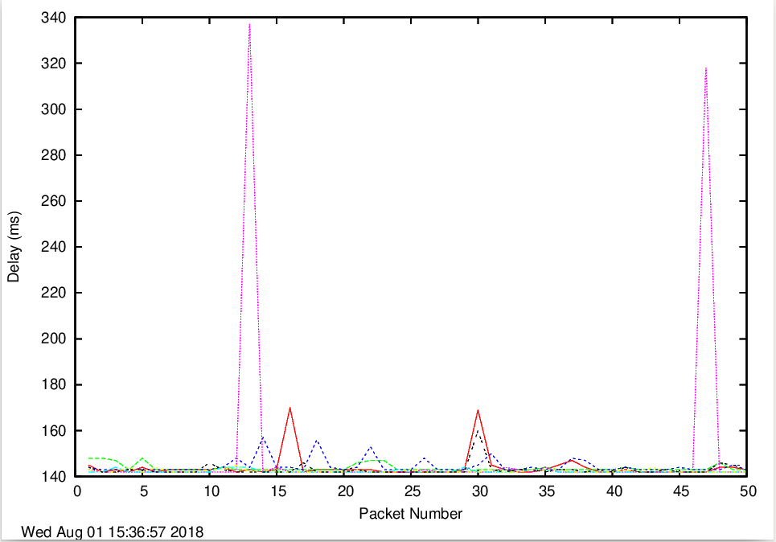
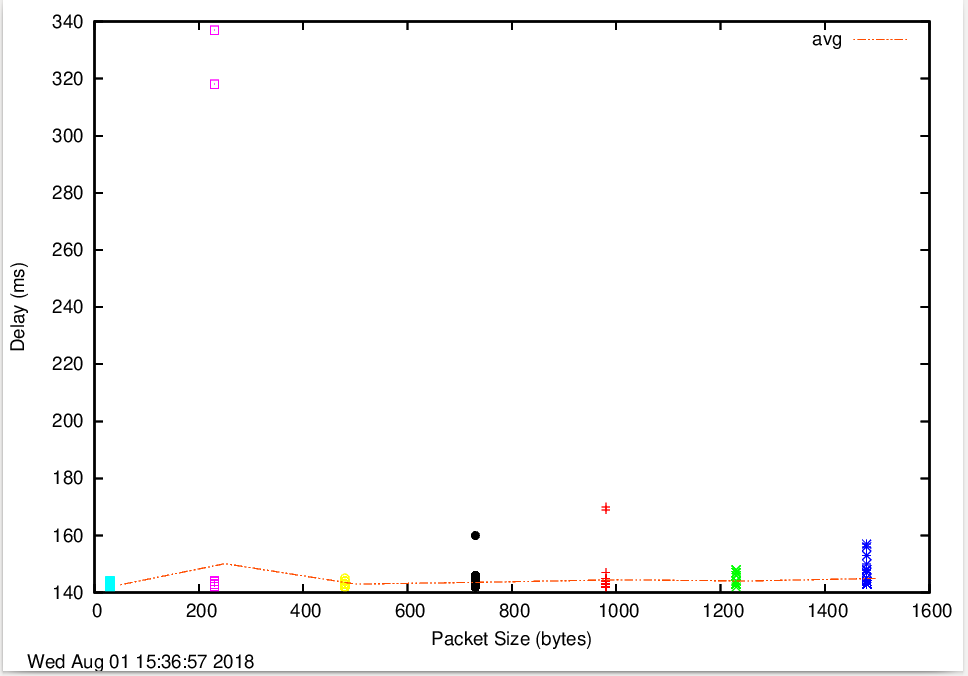
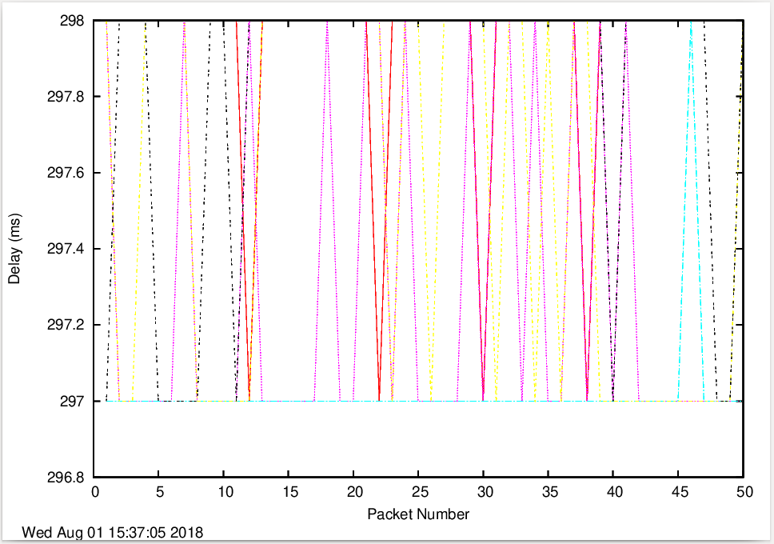
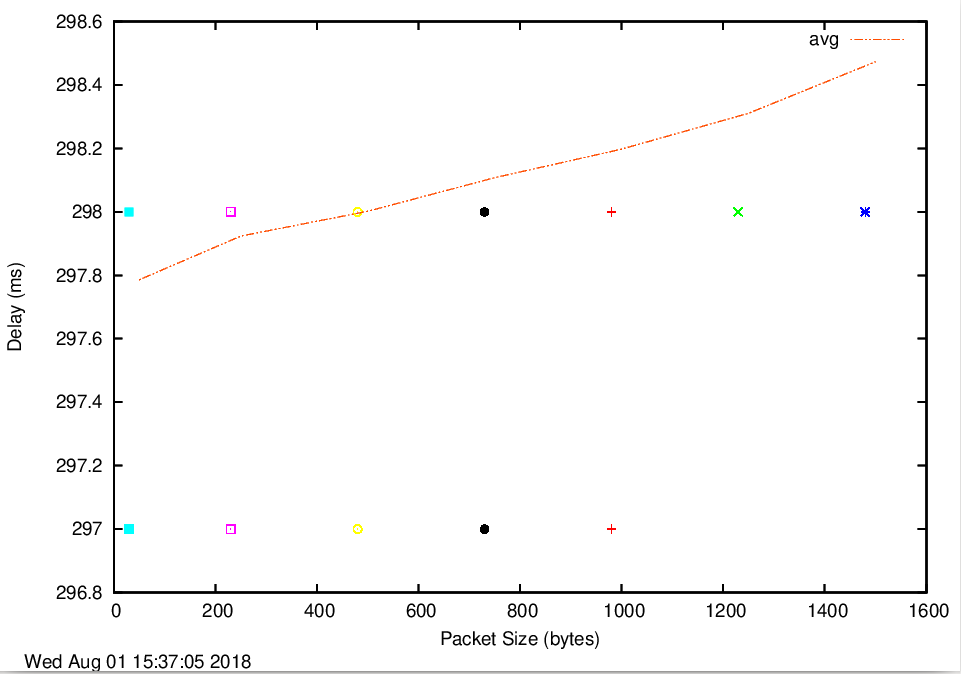
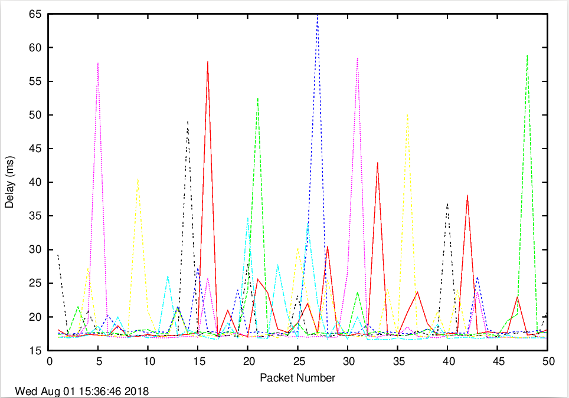
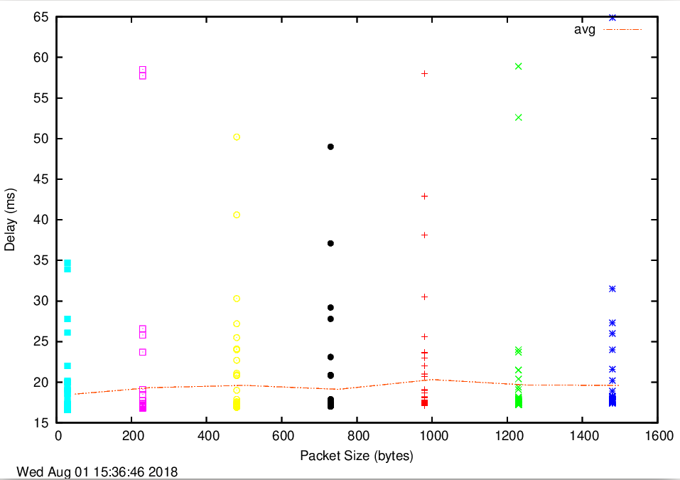
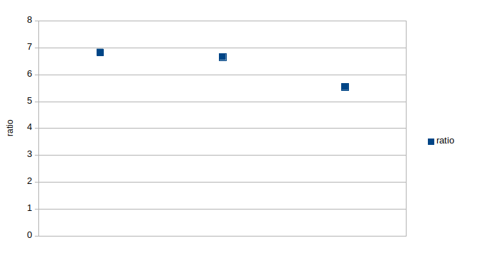

# Lab 1

- Author: Jack Jiang
- email: z5129432@student.unsw.edu.au

## Exercise 1

### 1

IP:  216.58.196.132

Multi IP address is good for load balance reason. We can always connect to the server which is more close to us or has a lighter load.

### 2

Name: localhost

it is a reserved IP address. Computers use it to refer to themselves.

## Excercise 2

### 1. unreachable by PING and Web browser

this is because the host does not exist in DNS server.
- www.getfittest.com.au
- www.hola.hp

### 2. only unreachable by PING

Because the server has been configured(maybe by firewall) to not response to PING.
- http://www.kremlin.ru/

### 3. only unreachable by a Web browser

There is no web server running in this host.
- 8.8.8.8

## Exercise 3

### 1

```
traceroute to www.columbia.edu (128.59.105.24), 30 hops max, 60 byte packets
 1  cserouter1-server.cse.unsw.EDU.AU (129.94.242.251)  0.097 ms  0.108 ms  0.100 ms
 2  129.94.39.17 (129.94.39.17)  0.996 ms  1.023 ms  1.026 ms
 3  ombudnex1-vl-3154.gw.unsw.edu.au (149.171.253.35)  1.679 ms libudnex1-vl-3154.gw.unsw.edu.au (149.171.253.34)  1.859 ms  1.823 ms
 4  ombcr1-po-6.gw.unsw.edu.au (149.171.255.169)  1.257 ms libcr1-po-6.gw.unsw.edu.au (149.171.255.201)  1.238 ms ombcr1-po-5.gw.unsw.edu.au (149.171.255.197)  1.234 ms
 5  unswbr1-te-1-9.gw.unsw.edu.au (149.171.255.101)  1.326 ms  1.291 ms  1.351 ms
 6  138.44.5.0 (138.44.5.0)  1.497 ms  1.421 ms  1.409 ms
 7  et-1-3-0.pe1.sxt.bkvl.nsw.aarnet.net.au (113.197.15.149)  2.433 ms  2.231 ms  2.312 ms
 8  et-0-0-0.pe1.a.hnl.aarnet.net.au (113.197.15.99)  95.530 ms  95.553 ms  95.621 ms
 9  et-2-1-0.bdr1.a.sea.aarnet.net.au (113.197.15.201)  146.475 ms  146.494 ms  146.462 ms
10  abilene-1-lo-jmb-706.sttlwa.pacificwave.net (207.231.240.8)  156.388 ms  156.260 ms  156.237 ms
11  et-4-0-0.4079.rtsw.miss2.net.internet2.edu (162.252.70.0)  157.358 ms  157.309 ms  157.291 ms
12  et-4-0-0.4079.rtsw.minn.net.internet2.edu (162.252.70.58)  180.453 ms  180.642 ms  180.410 ms
13  et-1-1-2.4079.rtsw.eqch.net.internet2.edu (162.252.70.106)  189.019 ms  188.779 ms  188.737 ms
14  ae-1.4079.rtsw.clev.net.internet2.edu (162.252.70.130)  196.880 ms  196.940 ms  196.948 ms
15  buf-9208-I2-CLEV.nysernet.net (199.109.11.33)  201.267 ms  201.195 ms  201.216 ms
16  syr-9208-buf-9208.nysernet.net (199.109.7.193)  205.201 ms  204.934 ms  205.467 ms
17  nyc-9208-syr-9208.nysernet.net (199.109.7.162)  210.246 ms  210.421 ms  210.410 ms
18  columbia.nyc-9208.nysernet.net (199.109.4.14)  210.225 ms  210.267 ms  228.239 ms
19  cc-core-1-x-nyser32-gw-1.net.columbia.edu (128.59.255.5)  210.739 ms  210.682 ms  210.702 ms
20  cc-conc-1-x-cc-core-1.net.columbia.edu (128.59.255.210)  210.831 ms  210.822 ms  210.867 ms
21  columbiauniversity.org (128.59.105.24)  210.695 ms  210.702 ms  210.712 ms
```

There are 21 routers in between. Five of them are part of UNSW network. 

Between router 113.197.15.149 and 113.197.15.99, the package crosses the Pacific Ocean because the latency is the largest.

### 2

```
traceroute to www.ucla.edu (164.67.228.152), 30 hops max, 60 byte packets
 1  cserouter1-server.cse.unsw.EDU.AU (129.94.242.251)  0.206 ms  0.196 ms  0.185 ms
 2  129.94.39.17 (129.94.39.17)  1.331 ms  1.325 ms  1.309 ms
 3  ombudnex1-vl-3154.gw.unsw.edu.au (149.171.253.35)  2.779 ms libudnex1-vl-3154.gw.unsw.edu.au (149.171.253.34)  2.618 ms ombudnex1-vl-3154.gw.unsw.edu.au (149.171.253.35)  2.765 ms
 4  ombcr1-po-5.gw.unsw.edu.au (149.171.255.197)  1.493 ms  1.477 ms libcr1-po-5.gw.unsw.edu.au (149.171.255.165)  1.337 ms
 5  unswbr1-te-1-9.gw.unsw.edu.au (149.171.255.101)  2.476 ms  2.556 ms  2.549 ms
 6  138.44.5.0 (138.44.5.0)  2.885 ms  4.167 ms  4.135 ms
 7  et-1-3-0.pe1.sxt.bkvl.nsw.aarnet.net.au (113.197.15.149)  4.120 ms  3.635 ms  4.929 ms
 8  et-0-0-0.pe1.a.hnl.aarnet.net.au (113.197.15.99)  96.573 ms  96.484 ms  96.576 ms
 9  et-2-1-0.bdr1.a.sea.aarnet.net.au (113.197.15.201)  147.637 ms  146.978 ms  146.835 ms
10  cenichpr-1-is-jmb-778.snvaca.pacificwave.net (207.231.245.129)  163.609 ms  163.678 ms  163.427 ms
11  hpr-lax-hpr3--svl-hpr3-100ge.cenic.net (137.164.25.73)  171.176 ms  172.392 ms  172.185 ms
12  * * *
13  bd11f1.anderson--cr00f2.csb1.ucla.net (169.232.4.4)  172.543 ms bd11f1.anderson--cr001.anderson.ucla.net (169.232.4.6)  171.224 ms bd11f1.anderson--cr00f2.csb1.ucla.net (169.232.4.4)  171.651 ms
14  cr00f1.anderson--dr00f2.csb1.ucla.net (169.232.4.55)  204.726 ms cr00f2.csb1--dr00f2.csb1.ucla.net (169.232.4.53)  171.440 ms  171.406 ms
15  * * *
16  * * *
17  * * *
18  * * *
19  * * *
20  * * *
21  * * *
22  * * *
23  * * *
24  * * *
25  * * *
26  * * *
27  * * *
28  * * *
29  * * *
30  * * *
```

```
traceroute to www.u-tokyo.ac.jp (210.152.243.234), 30 hops max, 60 byte packets
 1  cserouter1-server.cse.unsw.EDU.AU (129.94.242.251)  0.105 ms  0.126 ms  0.103 ms
 2  129.94.39.17 (129.94.39.17)  0.998 ms  1.015 ms  0.979 ms
 3  libudnex1-vl-3154.gw.unsw.edu.au (149.171.253.34)  1.922 ms  1.926 ms  1.440 ms
 4  ombcr1-po-5.gw.unsw.edu.au (149.171.255.197)  1.170 ms libcr1-po-5.gw.unsw.edu.au (149.171.255.165)  1.251 ms  1.257 ms
 5  unswbr1-te-1-9.gw.unsw.edu.au (149.171.255.101)  1.271 ms  1.289 ms  1.328 ms
 6  138.44.5.0 (138.44.5.0)  1.403 ms  1.391 ms  1.370 ms
 7  et-0-3-0.pe1.bkvl.nsw.aarnet.net.au (113.197.15.147)  1.878 ms  2.014 ms  2.040 ms
 8  ge-4_0_0.bb1.a.pao.aarnet.net.au (202.158.194.177)  156.320 ms  156.247 ms  156.294 ms
 9  paloalto0.iij.net (198.32.176.24)  158.052 ms  158.116 ms  157.974 ms
10  osk004bb01.IIJ.Net (58.138.88.189)  271.360 ms osk004bb00.IIJ.Net (58.138.88.185)  288.765 ms osk004bb01.IIJ.Net (58.138.88.189)  271.258 ms
11  osk004ix51.IIJ.Net (58.138.106.126)  279.854 ms  279.852 ms  279.845 ms
12  210.130.135.130 (210.130.135.130)  280.017 ms  279.989 ms  271.103 ms
13  124.83.228.78 (124.83.228.78)  288.575 ms  288.563 ms  279.793 ms
14  124.83.252.250 (124.83.252.250)  286.325 ms  277.582 ms  277.519 ms
15  158.205.134.26 (158.205.134.26)  277.450 ms  286.383 ms  307.062 ms
16  * * *
17  * * *
18  * * *
19  * * *
20  * * *
21  * * *
22  * * *
23  * * *
24  * * *
25  * * *
26  * * *
27  * * *
28  * * *
29  * * *
30  * * *
```

It diverge at router et-0-3-0.pe1.bkvl.nsw.aarnet.net.au (113.197.15.147).

No. There is 12050 km between localhost and www.ucla.edu, while there is only 7891 km between localhost to www.u-tokyo.ac.jp. However, both of them has 30 routers.

### 3
speedtest to 129.94.208.147
```
traceroute to 129.94.208.147 (129.94.208.147), 30 hops max, 60 byte packets
 1  ge2-8.r01.sin01.ne.com.sg (202.150.221.169)  0.143 ms  0.141 ms  0.139 ms
 2  10.11.33.38 (10.11.33.38)  32.931 ms  32.936 ms  32.934 ms
 3  hutchcity3-10g.hkix.net (123.255.90.140)  53.147 ms  53.150 ms  53.218 ms
 4  d1-42-238-143-118-on-nets.com (118.143.238.42)  44.547 ms  48.850 ms 218.189.5.42 (218.189.5.42)  48.772 ms
 5  d1-6-224-143-118-on-nets.com (118.143.224.6)  195.212 ms  196.219 ms d1-26-224-143-118-on-nets.com (118.143.224.26)  203.632 ms
 6  aarnet.as7575.any2ix.coresite.com (206.72.210.64)  187.256 ms  195.124 ms  189.783 ms
 7  xe-0-0-3.pe1.tkpa.akl.aarnet.net.au (202.158.194.172)  318.453 ms  313.212 ms  304.088 ms
 8  et-0-1-0.200.pe1.wnpa.akl.aarnet.net.au (113.197.15.68)  314.497 ms  312.415 ms  312.249 ms
 9  xe-1-2-1.pe1.msct.nsw.aarnet.net.au (113.197.15.66)  336.606 ms  339.582 ms  331.214 ms
10  et-8-1-0.pe1.brwy.nsw.aarnet.net.au (113.197.15.152)  348.452 ms  347.925 ms  352.990 ms
11  138.44.5.1 (138.44.5.1)  334.095 ms  335.242 ms  342.476 ms
12  libcr1-te-1-5.gw.unsw.edu.au (149.171.255.102)  323.924 ms  333.593 ms  334.018 ms
13  libudnex1-po-1.gw.unsw.edu.au (149.171.255.166)  342.098 ms ombudnex1-po-1.gw.unsw.edu.au (149.171.255.202)  326.927 ms  337.586 ms
14  ufw1-ae-1-3154.gw.unsw.edu.au (149.171.253.36)  344.395 ms  335.511 ms  335.518 ms
15  129.94.39.23 (129.94.39.23)  337.211 ms  336.197 ms  336.894 ms
16  * * *
17  * * *
18  * * *
19  * * *
20  * * *
21  * * *
22  * * *
23  * * *
24  * * *
25  * * *
26  * * *
27  * * *
28  * * *
29  * * *
30  * * *
```

129.94.208.147 to speedtest
```
traceroute to www.speedtest.com.sg (202.150.221.170), 30 hops max, 60 byte packets
 1  cserouter1-trusted.cse.unsw.EDU.AU (129.94.208.251)  0.124 ms  0.133 ms  0.107 ms
 2  129.94.39.17 (129.94.39.17)  1.077 ms  1.065 ms  1.010 ms
 3  ombudnex1-vl-3154.gw.unsw.edu.au (149.171.253.35)  1.850 ms libudnex1-vl-3154.gw.unsw.edu.au (149.171.253.34)  1.438 ms ombudnex1-vl-3154.gw.unsw.edu.au (149.171.253.35)  1.810 ms
 4  ombcr1-po-5.gw.unsw.edu.au (149.171.255.197)  1.254 ms ombcr1-po-6.gw.unsw.edu.au (149.171.255.169)  1.233 ms libcr1-po-6.gw.unsw.edu.au (149.171.255.201)  1.254 ms
 5  unswbr1-te-2-13.gw.unsw.edu.au (149.171.255.105)  1.295 ms  1.275 ms  1.307 ms
 6  138.44.5.0 (138.44.5.0)  1.506 ms  1.423 ms  1.480 ms
 7  et-0-3-0.pe1.alxd.nsw.aarnet.net.au (113.197.15.153)  1.786 ms  1.968 ms  1.908 ms
 8  xe-0-0-3.pe1.wnpa.akl.aarnet.net.au (113.197.15.67)  24.560 ms  24.649 ms  24.565 ms
 9  et-0-1-0.200.pe1.tkpa.akl.aarnet.net.au (113.197.15.69)  24.759 ms  24.751 ms  24.774 ms
10  xe-0-2-6.bdr1.a.lax.aarnet.net.au (202.158.194.173)  148.382 ms  148.363 ms  148.297 ms
11  singtel.as7473.any2ix.coresite.com (206.72.210.63)  321.688 ms  321.702 ms  321.684 ms
12  203.208.154.45 (203.208.154.45)  358.726 ms 203.208.172.173 (203.208.172.173)  336.353 ms  336.340 ms
13  203.208.182.77 (203.208.182.77)  341.645 ms 203.208.177.110 (203.208.177.110)  353.230 ms  355.650 ms
14  202-150-221-170.rev.ne.com.sg (202.150.221.170)  357.358 ms  357.452 ms  355.681 ms
```

telstra to 129.94.208.147
```
 1  gigabitethernet3-3.exi2.melbourne.telstra.net (203.50.77.53)  0.353 ms  0.203 ms  0.242 ms
 2  bundle-ether3-100.win-core10.melbourne.telstra.net (203.50.80.129)  1.738 ms  1.477 ms  2.239 ms
 3  bundle-ether12.ken-core10.sydney.telstra.net (203.50.11.122)  13.486 ms  12.097 ms  12.736 ms
 4  bundle-ether1.ken-edge901.sydney.telstra.net (203.50.11.95)  11.983 ms  11.844 ms  11.860 ms
 5  aarnet6.lnk.telstra.net (139.130.0.78)  11.607 ms  11.600 ms  11.610 ms
 6  ge-6-0-0.bb1.a.syd.aarnet.net.au (202.158.202.17)  11.858 ms  11.724 ms  11.860 ms
 7  ae9.pe2.brwy.nsw.aarnet.net.au (113.197.15.56)  12.112 ms  12.098 ms  12.110 ms
 8  et-3-1-0.pe1.brwy.nsw.aarnet.net.au (113.197.15.146)  12.360 ms  12.472 ms  12.360 ms
 9  138.44.5.1 (138.44.5.1)  12.609 ms  12.726 ms  12.613 ms
10  ombcr1-te-1-5.gw.unsw.edu.au (149.171.255.106)  12.609 ms  12.599 ms  12.612 ms
11  ombudnex1-po-2.gw.unsw.edu.au (149.171.255.170)  12.859 ms  12.848 ms  12.859 ms
12  ufw1-ae-1-3154.gw.unsw.edu.au (149.171.253.36)  13.235 ms  13.223 ms  13.235 ms
13  129.94.39.23 (129.94.39.23)  13.358 ms  13.352 ms  13.482 ms
```

129.94.208.147 to telstra
```
traceroute to www.telstra.net (203.50.5.178), 30 hops max, 60 byte packets
 1  cserouter1-trusted.cse.unsw.EDU.AU (129.94.208.251)  0.185 ms  0.156 ms  0.132 ms
 2  129.94.39.17 (129.94.39.17)  1.153 ms  1.105 ms  1.107 ms
 3  ombudnex1-vl-3154.gw.unsw.edu.au (149.171.253.35)  8.825 ms  8.825 ms  8.793 ms
 4  ombcr1-po-6.gw.unsw.edu.au (149.171.255.169)  1.381 ms libcr1-po-6.gw.unsw.edu.au (149.171.255.201)  1.495 ms  1.467 ms
 5  unswbr1-te-1-9.gw.unsw.edu.au (149.171.255.101)  1.317 ms unswbr1-te-2-13.gw.unsw.edu.au (149.171.255.105)  1.297 ms  1.303 ms
 6  138.44.5.0 (138.44.5.0)  1.657 ms  1.533 ms  1.424 ms
 7  et-0-3-0.pe1.bkvl.nsw.aarnet.net.au (113.197.15.147)  1.814 ms  1.803 ms  1.748 ms
 8  ae9.bb1.a.syd.aarnet.net.au (113.197.15.57)  2.064 ms  2.124 ms  2.195 ms
 9  gigabitethernet1-1.pe1.b.syd.aarnet.net.au (202.158.202.18)  102.862 ms  102.869 ms  102.850 ms
10  gigabitethernet3-11.ken37.sydney.telstra.net (139.130.0.77)  2.965 ms  3.164 ms  3.165 ms
11  bundle-ether13.ken-core10.sydney.telstra.net (203.50.11.94)  4.405 ms  4.382 ms  5.034 ms
12  bundle-ether10.win-core10.melbourne.telstra.net (203.50.11.123)  15.869 ms  15.471 ms  15.387 ms
13  gigabitethernet5-0.exi-service2.melbourne.telstra.net (203.50.80.132)  13.936 ms  13.880 ms  13.782 ms
14  * * *
15  * * *
16  * * *
17  * * *
18  * * *
19  * * *
20  * * *
21  * * *
22  * * *
23  * * *
24  * * *
25  * * *
26  * * *
27  * * *
28  * * *
29  * * *
30  * * *
```

IP of speedtest is 202.150.221.170; IP of telstra is 203.50.5.178

No, the reverse path does NOT go through the same routers as the forward path.

No, the IP is not the same as common routers between the forward and the reverse path, because when routing, it will pick the nearest IP, and the nearest IP may not be the same between the forward and the backward path.

## Excercise 4

www.nus.edu.sg_delay.png



www.nus.edu.sg_scatter.png



www.tu-berlin.de_delay.png



www.tu-berlin.de_scatter.png



www.uq.edu.au_delay.png



www.uq.edu.au_scatter.png



### 1

- UNSW to www.nus.edu.sg (137.132.21.27) is 6310km
- UNSW to  www.tu-berlin.de (130.149.7.201) is 16100km
- UNSW to  www.uq.edu.au (130.102.131.123) is 730.3km



1. The speed is less than light because it may be in some medium
2. The actual distance may be longer than a straight line distance

### 2

it varies over time because of the congestion status which may affect the queue delay

### 3

- propagation delay is equal to d/S, which does NOT depend on the packet size.
- transmission delay is equal to L/R, which is proportional to the packet size
- processing delay depend on the packet size because larger size packet needs more processing time (e.g. calculate checksum).
- queuing delay does NOT depend on the packet size, it depends on buffer size.