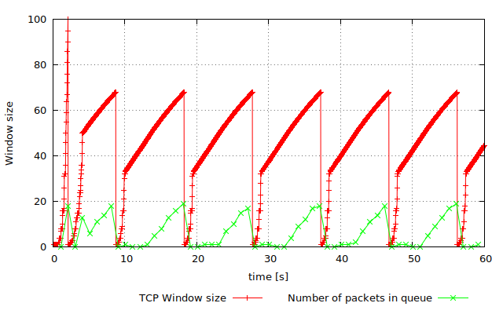
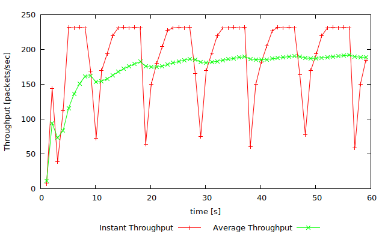
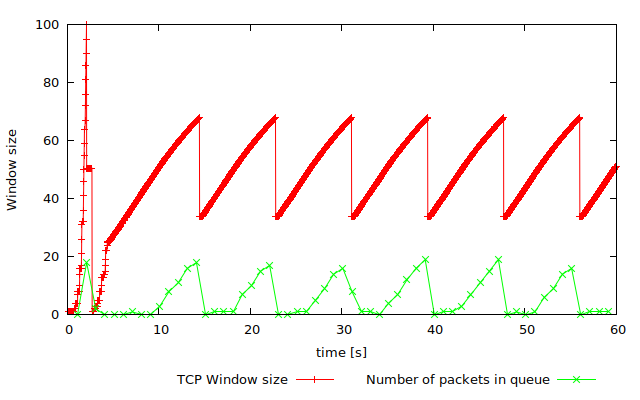
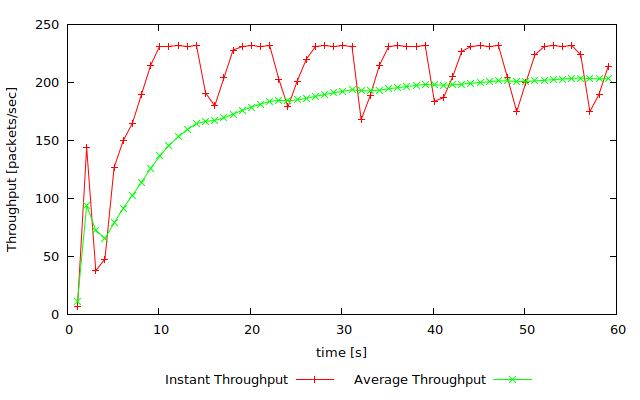
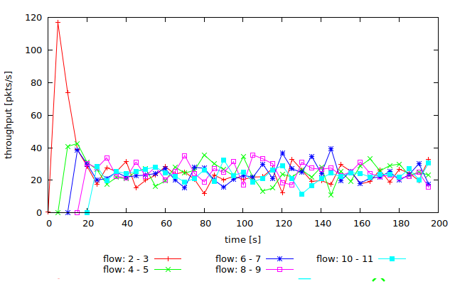

written by Jack Jiang(z5129432) at Sep 12, 2018

# Revision of TCP Congestion Control

## Question 1. Name the loss events that occur at 1 and 2. Explain why the congestion window is changed differently in those two cases.
- 1: duplicate ACK, congestion window reduce to half
- 2: timeout, congestion window set to zero.
- Because timeout is a more serious issue.

## Question 2. What phase of the TCP congestion control algorithm coincides with the circled segment marked by 3 ?
- slow start

## Question 3. What phase of the TCP congestion control algorithm coincides with the circled segment marked by 4 ?
- additive increase

## Question 4: Why is the congestion window increased more rapidly at 3 than at 4?
- because in 3, it increases exponentially

## Question 5: Can you precisely explain what happens to the window after 2 ? 
- it first enter a slow start phase, windows size doubles every RTT
- after it reaches a threshold, which is equal to CWND/2, the CWND increase by 1/CWND every RTT.

# Exercise 1: Understanding TCP Congestion Control using ns-2 

## Question 1:

### What is the maximum size of the congestion window that the TCP flow reaches in this case?
- about 69

### What does the TCP flow do when the congestion window reaches this value? Why? 
- it set to 1
- because the queue is full, it start to drop packages.

### What happens next?
- it start to grow exponentially before reach the threhold
- after that, it start to increase linearly

## Question 2: What is the average throughput of TCP in this case? (both in number of packets per second and bps) 

- 190 packets/second
- 190 * 540 * 8 = 820800bps

## Question 3: Rerun the above script, each time with different values for the max congestion window size but the same RTT (i.e. 100ms). 

### How does TCP respond to the variation of this parameter? 
- if we increase the max congestion windows size, the initial windows size will increase, but soon drop to 1. The fowlling windows size will be the same.
- if we decrease the max congestion windows size to a low value, so that the window size will never exceed a threshod. The window size will be stable.

### Find the value of the maximum congestion window at which TCP stops oscillating (i.e., does not move up and down again) to reach a stable behaviour. What is the average throughput (in packets and bps) at this point?

- about 65
- about 220 packets/s
- 231 * 540 * 8 = 950400bps

### How does the actual average throughput compare to the link capacity (1Mbps)? 

- the actual average throughput is less thant and close to the link capacity.

## Question 4: Repeat the steps outlined in Question 1 and 2 (NOT Question 3) but for TCP Reno. Compare the graphs for the two implementations and explain the differences. (Hint: compare the number of times the congestion window goes back to zero in each case). 

- For Tahoe, the graph goes to zero every 10 seconds
- For Reno, the graph only goes to zero at the begining

### How does the average throughput differ in both implementations? 

- the average throughput for Reno is highter, because the instance throughput only drops to half instead of zero in Reno.

# Exercise 2: Flow Fairness with TCP

## Question 1: Does each flow get an equal share of the capacity of the common link (i.e., is TCP fair) ? Explain which observations lead you to this conclusion.

-Yes, becasue all the TCP flows' throughput are about 20 packages/seconds.

## Question 2. 

### What happens to the throughput of the pre-existing TCP flows when a new flow is created? 

- the pre-existing TCP flows' throughput drops to half when a new flow is created. The new TCP flow will share the capacity with the pre-existing one.

### Explain the mechanisms of TCP which contribute to this behaviour. 

- TCP uses AIMD, the throughput will converges in that way.

### Argue about whether you consider this behaviour to be fair or unfair. 

- it is fair because every flow are treated equally
- it is unfair in some situation when we need some kind of priority; futhermore, we can cheap by increasing windows size more quickly, or open more TCP connections. That will lead to unfairenss as well.

# Exercise 3: TCP competing with UDP 

## Question 1: How do you expect the TCP flow and the UDP flow to behave if the capacity of the link is 5 Mbps ? 

- UDP will reach it max speed which is about 4M
- TCP will use the remained capacity which is about 1M

## Question 2: Why does one flow achieve higher throughput than the other? Try to explain what mechanisms force the two flows to stabilise to the observed throughput. 
- because UDP does not have a flow control, it will always try to deleivery files in its maximun speed.
- So that TCP can only use the remained capacity

## Question 3: List the advantages and the disadvantages of using UDP instead of TCP for a file transfer, when our connection has to compete with other flows for the same link. What would happen if everybody started using UDP instead of TCP for that same reason? 

- UDP does not have a flow control, it can transfer files as quickly as possible
- But if every one uses UDP instead of TCP. When the link capacity become the bottleneck, the overall speed will drop significantly. The whole network will become usable.
